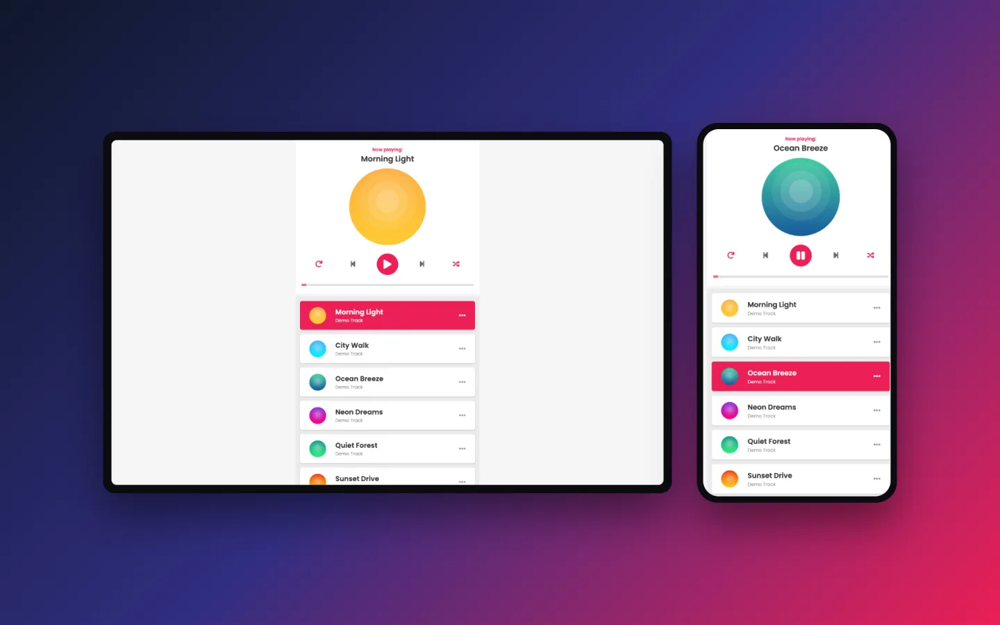
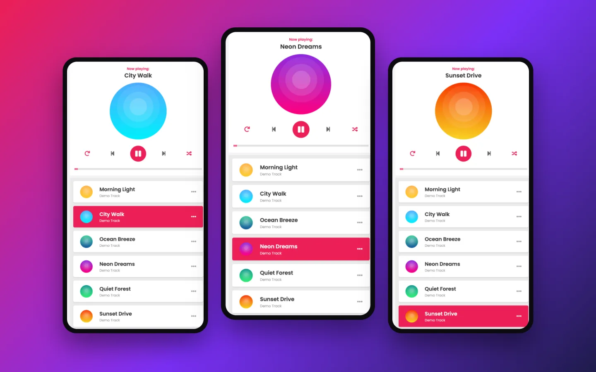

## Overview

A single-page music player inspired by Zing MP3, built with plain HTML, CSS and vanilla JavaScript — no framework and no build step.

- **Role:** Personal project
- **Year:** 2024
- **Live:** [hoangpham.is-a.dev/zing-mp3-clone](https://hoangpham.is-a.dev/zing-mp3-clone/)
- **Source:** [github.com/hoangpham2263/zing-mp3-clone](https://github.com/hoangpham2263/zing-mp3-clone)

## Features

- Now playing dashboard with the song title and a circular CD that spins while music plays
- Play/pause, previous, next and a seekable progress bar synced to playback
- Shuffle mode that never repeats the current song, and repeat mode for the current track
- Playlist that highlights the active song and scrolls it into view; click any song to play it
- CD shrinks and fades out as the playlist scrolls
- Shuffle and repeat settings saved to `localStorage`

## Screenshots

## Tech

- HTML5 `<audio>` and range input
- CSS3 with the Poppins font
- Vanilla JavaScript (ES6), Web Animations API for the spinning CD
- Hosted on GitHub Pages
